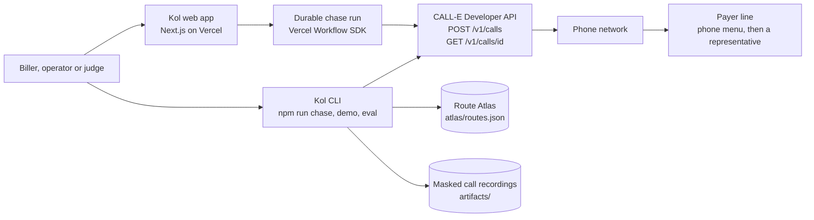
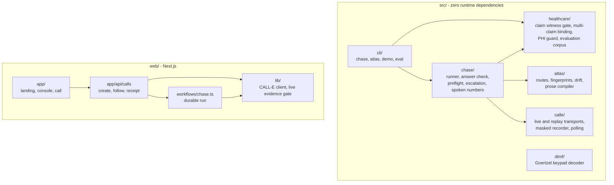
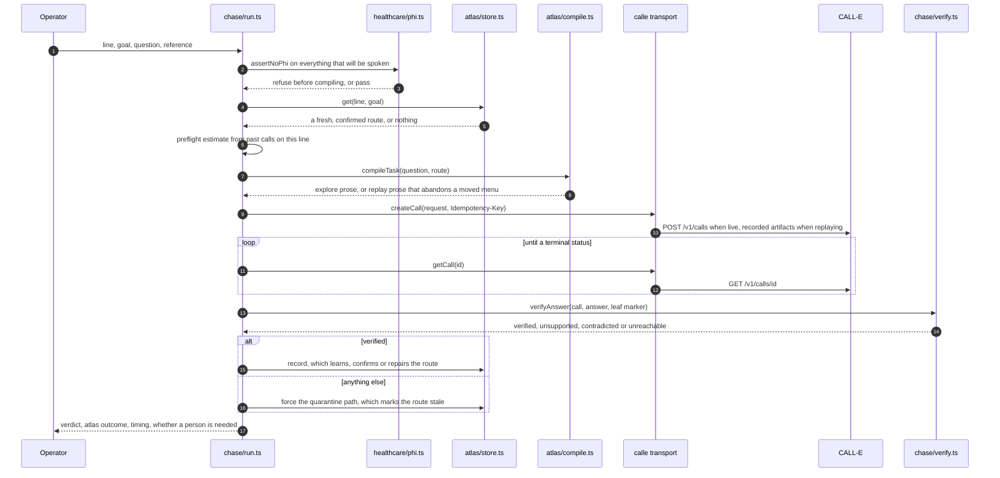
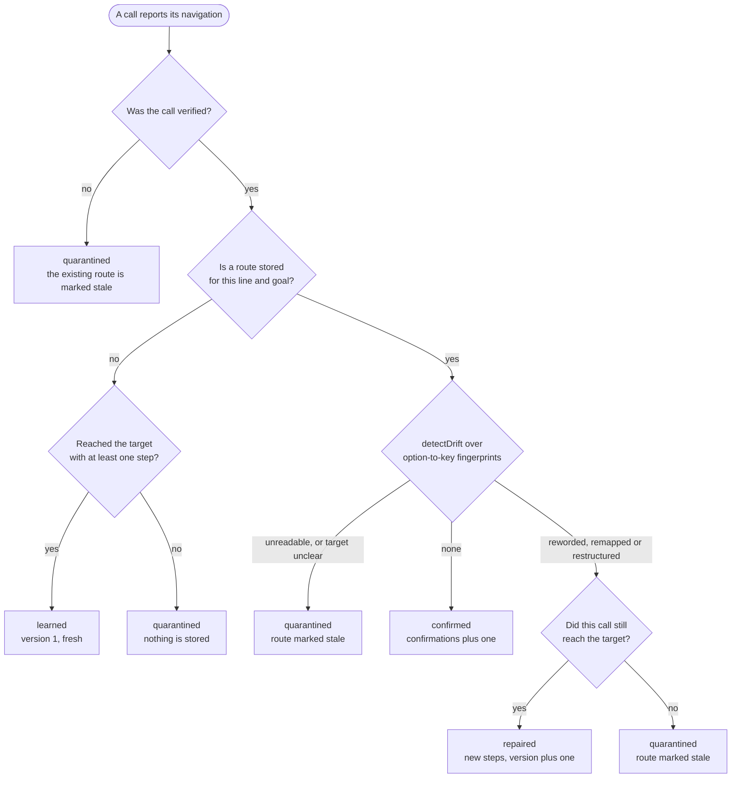
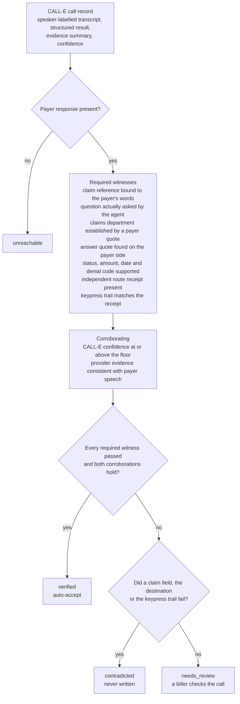
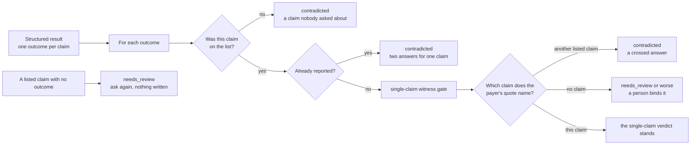
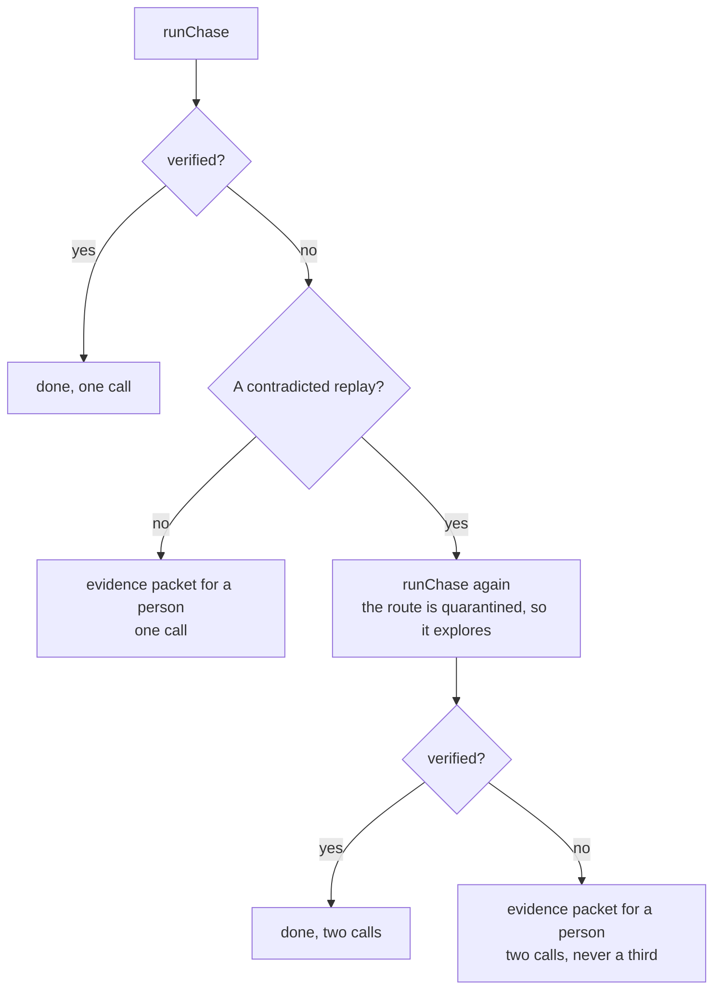
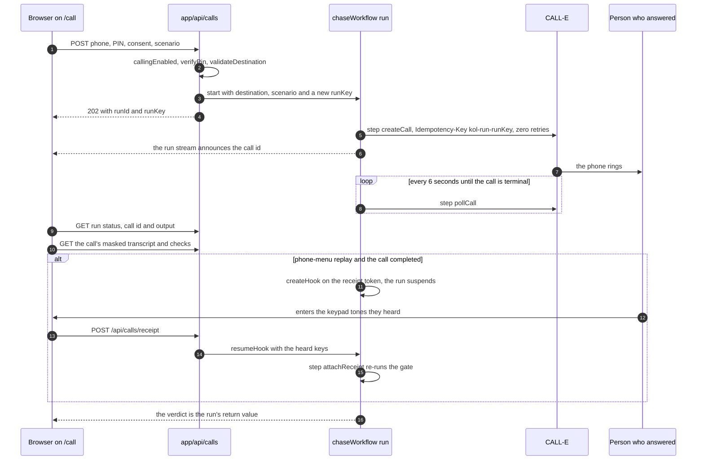
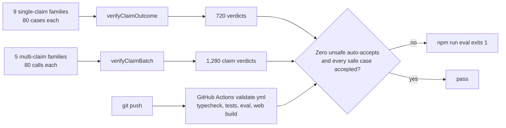
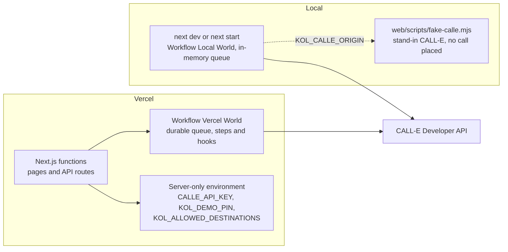

# Kol architecture

Kol makes a CALL-E phone call prove its answer. This document follows a claim-status chase from
the request to the verdict and names the file that owns each step.

- [The rules everything follows](#the-rules-everything-follows)
- [System context](#system-context)
- [Repository map](#repository-map)
- [One chase, end to end](#one-chase-end-to-end)
- [What a call is allowed to teach the Route Atlas](#what-a-call-is-allowed-to-teach-the-route-atlas)
- [The healthcare witness gate](#the-healthcare-witness-gate)
- [Several claims on one call](#several-claims-on-one-call)
- [Escalation: two attempts, then a person](#escalation-two-attempts-then-a-person)
- [The live lab: one durable run per call](#the-live-lab-one-durable-run-per-call)
- [Evaluation and CI](#evaluation-and-ci)
- [Runtime and deployment](#runtime-and-deployment)
- [Data contracts](#data-contracts)
- [Trust boundaries](#trust-boundaries)
- [Known limits](#known-limits)
- [Where to start reading](#where-to-start-reading)

## The rules everything follows

1. **The AI caller is never the only witness.** Anything the model reports about itself — its
   structured result, its keypresses, its evidence summary, its confidence — is a claim to
   check against what the other party actually said, never evidence on its own.
2. **Checks only reduce trust.** A high confidence score can never override a missing witness.
3. **Only a verified call may teach the Route Atlas.** A call Kol cannot vouch for marks the
   cached route stale, so the next chase explores instead of repeating it.
4. **Replay is the default.** A real call is always a deliberate act: `KOL_MODE=live` and
   `--confirm` on the CLI, or a PIN, an allowlisted number and explicit consent in the web lab.

## System context

There are two ways in. The **CLI** (`src/`, zero runtime dependencies) runs chases, the demo and
the evaluation, and replays recorded calls without a network by default. The **web app**
(`web/`) is the judge-facing product: a landing page, an evidence console over fictional data,
and a guarded live lab that places real calls through a durable workflow run.

## Repository map

| Path | Owns | Start with |
| --- | --- | --- |
| `src/calle/` | The CALL-E transport. `createTransport` returns `ReplayCalle` unless `KOL_MODE=live`. `LiveCalle` records every response through `Recorder`, which masks numbers on the way in. | `index.ts`, `recorder.ts` |
| `src/atlas/` | Routes keyed by line and goal, option-to-key fingerprints, drift classification, and the compiler that turns a route into task prose, since the API has no navigation parameter. | `store.ts`, `drift.ts`, `compile.ts` |
| `src/chase/` | One chase from request to result, the line-agnostic answer check, the cost preflight, and the two-attempt escalation ladder. | `run.ts`, `verify.ts`, `escalate.ts` |
| `src/healthcare/` | The claim-specific witness gate, per-claim binding for several claims on one call, the PHI guard, and the seeded adversarial corpus. | `verify.ts`, `batch.ts`, `phi.ts` |
| `src/dtmf/` | Reads pressed keys out of a call recording, so a route can be checked against audio instead of the model's report. | `decode.ts` |
| `web/workflows/` | The durable run behind every live call. | `chase.ts` |
| `web/app/api/calls/` | Guarded call creation, run and call status, and the receipt that resumes a suspended run. | `route.ts`, `receipt/route.ts` |
| `web/lib/` | The server-side CALL-E client and the live lab's evidence gate. | `calle.ts`, `live-evidence.ts` |
| `schemas/`, `examples/` | The portable route interchange contract and a fictional example route. | `kol-route.schema.json` |
| `fixtures/`, `probes/` | A TwiML phone-menu simulator, a laptop-played menu with microphone capture, and the day-zero probes that refuse to dial without `--confirm`. | `ivr-sim/server.ts`, `probes/run.ts` |
| `test/`, `web/scripts/` | 114 tests over every rule below, and no-call scripts that drive a durable run end to end. | `healthcare.test.ts`, `drive-chase.mjs` |

The Workflow SDK generates `web/app/.well-known/workflow/` at build time; it is not tracked.

## One chase, end to end

`src/chase/run.ts` owns this path. It is what `npm run chase` executes.

`chase/verify.ts` is deliberately line-agnostic: it checks that a human answered, that every
number in the answer was spoken by the callee, that a destination marker was heard when one is
expected, and the provider's confidence. The stricter claim-specific gate below is what the
evaluation, the demo and the upstream contribution app run.

## What a call is allowed to teach the Route Atlas

`Atlas.record` in `src/atlas/store.ts` folds one call's navigation report into the atlas. The
runner only calls it for a verified call; every other verdict is forced down the quarantine path.

A route is replayable only while its status is `fresh`, it has steps, and it has at least one
confirmation (`isReplayable` in `src/atlas/types.ts`). Drift is ranked by how dangerous it is:

| Drift | Severity | Why |
| --- | --- | --- |
| `none` | 0 | The menu still maps the same options to the same keys. |
| `reworded` | 1 | The words changed; a greeting rewrite is noise. |
| `unreadable` | 2 | No option-to-key pairs could be read, so nothing can be vouched for. |
| `remapped` | 3 | A digit now leads somewhere else: a cached route would walk into the wrong department and may still return a plausible answer. |
| `restructured` | 3 | The depth or shape of the tree changed. |

## The healthcare witness gate

`verifyClaimOutcome` in `src/healthcare/verify.ts` decides whether a structured claim result may
be accepted. Every required check is deterministic, and none of them asks one model to grade
another.

- **Route receipts** must be independent of the model: a fixture log, decoded DTMF audio or a
  provider event. The model's own list of keypresses can never verify itself.
- **Spoken numbers** are parsed by `src/chase/numbers.ts`, so "four four seven one" and "one
  thousand two hundred forty" ground the same fields as digits.
- **Next actions** are labelled operator policy unless the payer said them; they never block,
  and they are never presented as payer testimony.
- **Provider evidence** is CALL-E's free-text justification of its own result. If it asserts a
  status word or a number the payer never said, the result cannot be auto-accepted.

## Several claims on one call

A biller reads several claim numbers once they are through the phone menu. That opens a failure
the single-claim gate cannot see: every number was spoken and every quote is real, but claim A
was filed with claim B's answer. `verifyClaimBatch` in `src/healthcare/batch.ts` binds each
answer to its own claim.

## Escalation: two attempts, then a person

`runChaseWithEscalation` in `src/chase/escalate.ts` never places a third call.

Only a contradicted replay earns a retry, because the cached route is the one thing a second call
can change. The evidence packet carries the failed checks, the numbers nobody said and the raw
transcript, not a summary of it.

## The live lab: one durable run per call

A payer call is a long process with a person at the end of it. It rings, holds and ends; the
transcript lands; and in the phone-menu mode the person who answered then reports which keypad
tones they heard, which can take a minute or a day. None of that should depend on a browser tab
staying open, and none of it may dial twice. So every call from `/call` is a Vercel Workflow run
(`web/workflows/chase.ts`).

The live lab's gate is `web/lib/live-evidence.ts`. It applies the same witness rules to the
demo's fixed fictional claim and exposes only a masked `PublicCallState` to the browser.

| Mode | What the person answering does | Witnesses | Best possible verdict |
| --- | --- | --- | --- |
| Reachability check | Says one exact phrase | The phrase on the recipient side of the transcript | `verified` |
| Claim evidence workflow | Plays the claims desk with fictional data | Question, destination, claim reference, status, amount, date; no independent route receipt exists | `needs_review` |
| IVR route replay | Reads a two-level menu, then attaches the tones they heard | Route reported, replay followed the atlas, menu read out, question asked, operator-attested receipt | `verified` |

`web/scripts/fake-calle.mjs` stands in for CALL-E so the run can be exercised with no call:
`drive-chase.mjs` drives one run to a verified verdict, and `kill-and-resume.mjs` kills the server
mid-poll, restarts it, and checks that the same run finishes with exactly one create.

## Evaluation and CI

`npm run eval` regenerates both matrices from code; there is no stored score to edit. The
families are listed in [METHODOLOGY.md](METHODOLOGY.md), which also separates what was observed on
real calls from what is synthetic.

## Runtime and deployment

Locally, the Workflow SDK runs on its Local World, whose queue lives in memory: a restarted server
resumes a run from its last checkpoint once it is woken. On Vercel, the same code runs on the
Vercel World with a durable queue. `KOL_CALLE_ORIGIN` points the client at the stand-in for tests.

## Data contracts

| Contract | Defined in | What it fixes |
| --- | --- | --- |
| `CreateCallRequest` | `src/calle/types.ts` | The fields CALL-E accepts: task, recipients, result schemas, metadata and webhook URL. Navigation travels only in the task prose. |
| `NAVIGATION_RESULT_SCHEMA` | `src/atlas/schema.ts` | Every menu level heard, the action taken at each, whether the target was reached, the hold estimate and the final answer. |
| `CLAIM_STATUS_RESULT_SCHEMA` | `src/healthcare/schema.ts` | One claim's fields plus exact department, question and answer evidence. |
| `CLAIM_BATCH_RESULT_SCHEMA` | `src/healthcare/schema.ts` | Several claims, each with its own question and answer evidence quoting the claim number. |
| `kol-route.schema.json` | `schemas/` | The portable route interchange format; `examples/fixture-health-plan-route.json` is a fictional instance. |
| `PublicCallState` | `web/lib/live-evidence.ts` | Everything the browser may see about a live call: masked transcript, extracted fields, checks and verdict. |

## Trust boundaries

- **CALL-E output is untrusted.** The UI labels transcripts as untrusted provider output, and the
  gates check the model's structured result, keypress report, evidence summary and confidence
  against speaker-labelled transcript spans.
- **Secrets stay on the server.** The CALL-E key never reaches the browser. The demo PIN is
  compared in constant time, and a call goes only to an exact allowlisted number.
- **PHI never enters a call.** `runChase` refuses before compiling when the request carries a
  member ID, date of birth, SSN, medical record number, diagnosis code, patient name, email or
  phone number, and the refusal masks what it found. The live lab only speaks fixed fictional
  scripts.
- **Numbers are masked everywhere they are stored or shown.** Artifacts are masked as they are
  written, live transcripts mask phone numbers and emails, and the CLI prints masked destinations.
- **An ambiguous create is never re-dialled.** Every create carries a stable idempotency key, and
  the durable run's create step runs once with retries disabled.
- **Webhooks are not trusted on arrival.** CALL-E's terminal webhooks are unsigned, so Kol
  reconciles through `GET /v1/calls/id` before acting on one.

## Known limits

- **Live keypad replay is not observed.** In three calls where a person read a two-level menu
  aloud, CALL-E's agent talked over the menu and pressed no keys. The replay path is proven
  against fixtures and a stand-in CALL-E; a real automated phone menu is still needed.
- **The live lab's route receipt is operator-attested.** A fixture log or decoded DTMF audio is
  the stronger witness.
- **There are two gate implementations.** `src/healthcare/verify.ts` serves the CLI, the evaluation
  and the upstream contribution app; `web/lib/live-evidence.ts` serves the live lab and is scoped
  to the demo's fictional claim.
- **The evaluation measures the gate, not payer accuracy.** It is synthetic by construction.
- **This is not a HIPAA-compliant service.** It holds no PHI and writes to no claim system.

## Where to start reading

1. `src/healthcare/verify.ts` — the witness gate, in about 200 lines.
2. `src/chase/run.ts` — one chase from request to result.
3. `src/atlas/store.ts` and `src/atlas/drift.ts` — what a call may teach.
4. `web/workflows/chase.ts` — the durable run behind every live call.
5. `test/` — every rule in this document has a test.
